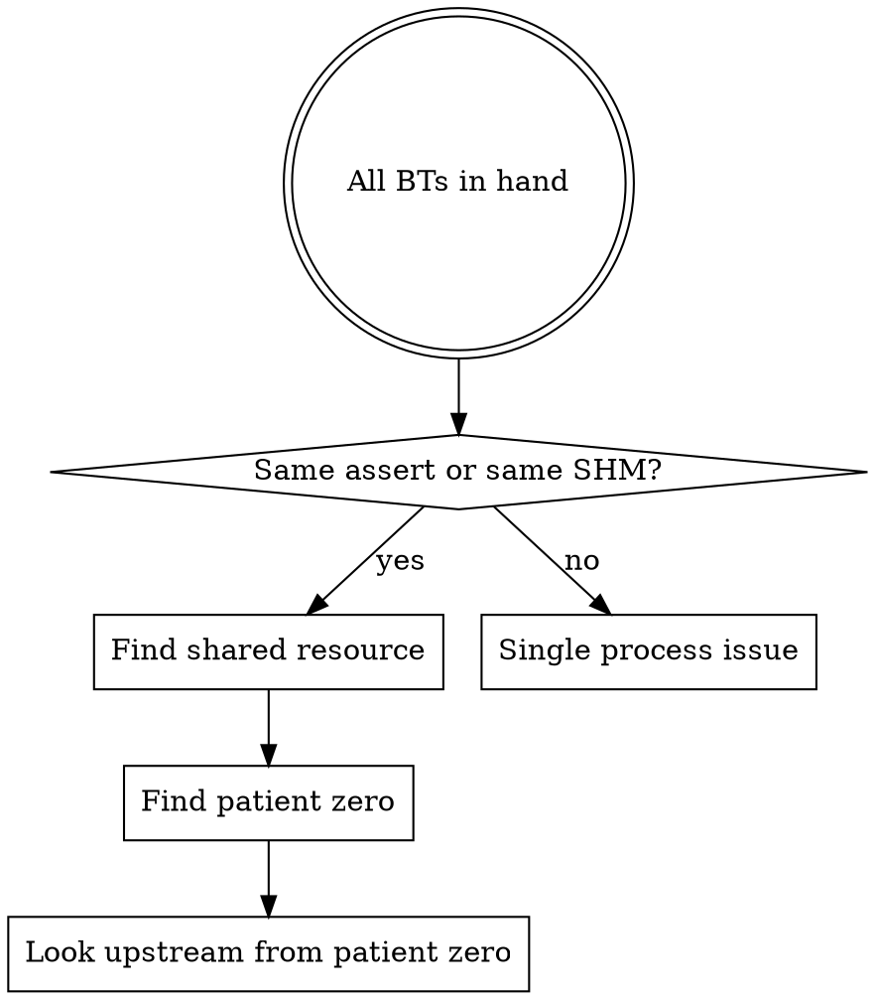

# Analyzing Coredumps

## Overview

Coredump analysis has two distinct failure modes: using the wrong tool (wrong-arch GDB crashes silently), and stopping at the symptom (assert failure) instead of the root cause (the memory corruption that triggered it). This skill addresses both.

## Phase 1: Initial Triage

```bash
# Inventory coredumps
ls core.* *.zst *.core

# Check architecture before doing anything else
file core.<name>   # "ELF 64-bit LSB core file, ARM aarch64" vs x86-64

# Decompress if needed
zstd -d core.<name>.zst -o core.<name>
# WARNING: Don't use -f (force) if output file already exists partially —
# it will silently produce a truncated file. Remove first, then decompress.
```

**Correlate each coredump with its binary:**
```
core.<process>.<uid>.<hostname>.<pid>.<timestamp>
# The process name tells you which deployment package to look in for binary+libs
```

## Phase 2: GDB Setup — The Critical Step

**Using the wrong GDB is catastrophic and silent.** A native x86_64 GDB on an aarch64 coredump will SIGSEGV itself — giving no useful output.

```bash
# Identify available cross-arch GDB
find /opt -name "*gdb*" -type f 2>/dev/null
# e.g., /opt/aarch64/gcc9.3/bin/aarch64-linux-gnu-gdb

# Always verify arch before loading
readelf -h core.<name> | grep Machine
# "Machine: AArch64" → need aarch64-linux-gnu-gdb
```

**Set solib search paths** — symbols are only resolved if GDB finds the matching .so files:
```bash
<arch>-linux-gnu-gdb ./bin/<process> ./core.<name>
(gdb) set solib-search-path ./lib:./lib/thirdparty:./lib/myapp
(gdb) bt
```

Discover the right paths with:
```bash
# What .so files does the binary reference?
readelf -d ./bin/<process> | grep RPATH
# Or check the deployment package structure for lib subdirs
find . -name "*.so" -type f | head -20
```

Embedded deployments often ship a private libc (BuildID-matched). Prefer that over the host system libc.

## Phase 3: Read All Backtraces First

For **every** crashed process:
```
(gdb) thread apply all bt
(gdb) info proc mappings   # shows memory regions incl. /dev/shm/ mappings
```

**Critical**: SHM data (`/dev/shm/`) is NOT saved in coredumps — Linux treats mmap'd files like shared libs. `x/addr` on SHM regions returns all zeros. `info proc mappings` shows the ranges but you cannot inspect the data.

Log files often contain the last backtrace — check these too:
```bash
# Find most recent logs for each crashed process
find . -name "*.log*" | sort | tail -20
grep -A 50 "signal\|backtrace\|Catch signal\|Abort" <process>.log
```

## Phase 4: Multi-Process Crash Correlation

When multiple processes crash near-simultaneously:



**Rules for identifying patient zero:**
1. Sort crash timestamps from logs or coredump filenames
2. The process with the **earliest** crash is usually the bug source or the first victim
3. A process that crashed *after* a restart of another process is a delayed victim (it was holding a stale SHM pointer)

## Phase 5: Symptoms vs Root Cause

**Assert failures are almost never the root cause.** They are the point where corruption became detectable.

| Symptom | Actual question to ask |
|---------|----------------------|
| `assert(magic == expected)` | What zeroed/corrupted the magic value? |
| `assert(unit->state == VALID)` | Who wrote to that memory region? |
| `SIGABRT` in process B | Which process owns the memory B was reading? |

**SHM corruption cascade pattern:**
```
Process A: OOB write → corrupts /dev/shm/<region> (owned by process B)
Process B: next SHM access → assert on corrupted header → SIGABRT
Process C: also uses same /dev/shm/<region> → same assert → SIGABRT
```

To find who caused the corruption: examine the earliest-crashing process's backtrace deeply. If its bt shows no obvious bug, look at what memory it was writing to at crash time and check `info proc mappings` to identify whose SHM region that was.

## Phase 6: Signal Chain Analysis

A process may receive **multiple signals**. Only the last signal generates the coredump.

```
Process crashes (SIGSEGV/SIGABRT)
  → custom ErrorHandler catches it
  → calls backtrace() + log flush (may block indefinitely)
  → alarm fires after N seconds → SIGQUIT/SIGKILL → coredump
```

Coredump shows the secondary signal (SIGQUIT=3), not the original one. Check logs:
```bash
grep "Catch signal\|signal 6\|signal 11\|SIGSEGV\|SIGABRT" <process>.log
```

## Phase 7: Common Memory Corruption Patterns

### size_t underflow → catastrophic memmove

```cpp
// OOB erase: vector size=8, idx=8 → erase(begin, begin+9)
vec.erase(vec.begin(), vec.begin() + idx + 1);

// Inside _M_erase → memmove(dest, src, end - (begin+9))
// end - (begin+9) = negative → size_t wraps to ~18 exabytes
// memmove forward-copies for ~18EB until it hits unmapped memory
// Overwrites everything between dest and the first unmapped page
```

**Red flag**: `size_t` subtraction where the result could be negative. Always check iterator validity before calling `erase`/`memmove`.

### SHM magic value corruption

SHM pool headers often contain magic numbers for integrity checking. After a bulk memory overwrite, these read as 0x0 or garbage. This is a reliable indicator that memory was overwritten rather than logically corrupted.

```bash
# In GDB, check suspected SHM header struct:
(gdb) p *shm_header   # look for magic/version fields showing 0x0
```

### Delayed crash pattern

Process A holds a pointer into SHM-X from before the corruption. It doesn't crash immediately. Only when it next accesses/releases that stale SHM block does the assert fire — potentially seconds to minutes after the original corruption event.

## Quick Reference

| Situation | Action |
|-----------|--------|
| GDB crashes with SIGSEGV | You're using wrong-arch GDB. Find cross-compiler GDB. |
| No symbols in bt | Set `solib-search-path` to process's own lib dirs |
| SHM regions show zeros | Expected. SHM is not saved in coredumps. |
| 3 processes same assert | Shared memory corruption. Find who writes that SHM. |
| Coredump shows SIGQUIT | Process had a signal handler. Real signal is in logs. |
| Partial .zst decompress | Remove output file, re-run `zstd -d` without `-f` |
| bt shows only 1-2 frames | Missing debug symbols. Use `disassemble` + register state. |

## Common Mistakes

1. **Stopping at the assert** — assert = symptom. The bug is the write that corrupted the checked value.
2. **Using system GDB on cross-arch coredump** — it crashes silently. Always `file core.*` first.
3. **Assuming the most-crashed process is the bug source** — it's often the most-used victim.
4. **Forgetting solib-search-path** — bt shows `??` everywhere, analysis is impossible.
5. **Using `-f` flag when re-decompressing** — silently produces truncated file if any output existed.
6. **Trusting `x/addr` on SHM regions** — always returns zeros; use `info proc mappings` to locate regions, then reason about corruption indirectly.
